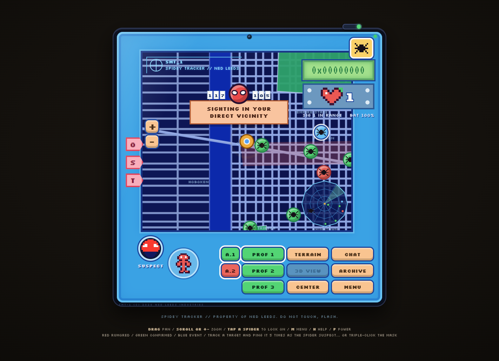

# SPIDEY TRACKER - Rehm Edition

In *Spider-Man: Brand New Day* (2026), Ned Leeds builds a crowd-sourced Spider-Man sightings tracker. This is that handheld, rebuilt for the browser by one very dedicated web head: chunky pixel hardware, a living city that spawns new sightings, a full synth soundtrack, and one easter egg that earns the name.



**Play it live:** [rehmthegreat.me](https://rehmthegreat.me) or [rehmthegreat.github.io/spidey-tracker](https://rehmthegreat.github.io/spidey-tracker/)

[](https://rehmthegreat.me)
[](LICENSE)
[](#how-it-works)
[](#how-it-works)

## Quick start

Zero dependencies, zero build step, zero network calls:

```bash
git clone https://github.com/RehmTheGreat/spidey-tracker
cd spidey-tracker
```

Open `index.html` in any modern browser and the device boots itself, even from `file://` with the Wi-Fi off: the fonts are embedded as base64 woff2 and nothing is fetched. Or skip the clone and [play it live](https://rehmthegreat.me).

Sound is synthesized live with WebAudio, so it kicks in on your first click (browser autoplay rules, not ours).

## The device tour

- **Boot.** The NED-OS v2.8.1 POST log types out ("POWER AND RESPONSIBILITY... CHECK"), the logo lands with a jingle, CALIBRATING WEB GRID runs a live progress bar, and the screen lifts with a one-shot CRT power-on bloom. Any input skips it.
- **The city.** An SVG lower-Manhattan-style world built entirely from data: Hudson and East River, 22 irregular avenues and 34 cross streets, three diagonal boulevards that cross the water as bridges, parks, ten canon district labels, an Empire State tower, pulsing salmon hot zones, and a MAP DATA 2028 stamp. The world extends past the camera clamps, so you never see void. Drag to pan, scroll or +/- to zoom.
- **Sightings.** Green CONFIRMED, red RUMORED, and blue EVENT tokens wander the grid. New crowd reports drop every 9-22 seconds with a ripple and a spawn arpeggio, and rumors periodically get "corrected" and relocate.
- **Lock-on.** Tap a spider for its report card, then TRACK: a dashed ring locks on and follows, the radar draws a gold vector, the tracking LED goes gold, sonar pings every 1.2 seconds, the camera follows, and the tiny Spider-Man figure bounces. PING fires a THWIP web-line from YOU to the target, and the target answers in chat.
- **Readouts.** Split-flap style tiles carry the nearest sighting's distance and bearing, the pixel heart counts signals in range, and the green hex LCD shows target IDs, share codes, and the occasional idle flutter.
- **Suspect file.** SPIDER-MAN (identity match ??), FLASH T. (12%), MR. HARRINGTON (9%). Ned is, respectfully, off-scent. LOCATE flies the camera to each suspect's last known district.
- **Panels.** MENU (or M) opens chat where web heads reply, the sighting archive with fly-to, a share code with a pixel QR and copy-to-clipboard, a report-your-own-sighting flow, four 10-second pixel trailers scored by the chiptune, three fan events with RSVP, settings, the activity log, and SAMSUNG EXCLUSIVE DOWNLOADS.
- **The notifications gag.** About eight seconds after your first boot, the device asks you the canon question. Saying YES has consequences. It remembers.
- **Terrain and 3D.** TERRAIN re-tints the whole map green and brightens the block layer under the streets. 3D VIEW tilts the map into perspective, but it is zoom-gated: get close first.
- **Attract mode.** Leave it alone for 45 seconds and the camera drifts between hot zones and landmarks like a store demo. Any input wakes it.
- **Hardware details.** Camera lens in the bezel, breathing power LED, SMT-1 serial plate, a spider patrolling the radar rim, scanlines, a battery meter that really drains, and a console surprise for anyone who opens devtools. Hi, Flash.
- **All synth, no samples.** Every key click, ping, jingle, alert sting, and the 8-bar chiptune theme comes from WebAudio oscillators and noise buffers. There are zero audio files in this repo.
- **One easter egg.** See below. No spoilers.

## Controls

Everything is clickable, draggable, and keyboard-reachable.

| Input | Action |
| --- | --- |
| Drag | Pan the map |
| Scroll or +/- | Zoom |
| Click a spider | Select it, open its target card |
| TRACK / PING | Lock on and follow / THWIP the target |
| Tabs 0 / S / T | Reset layers / toggle sightings / toggle web trace |
| Power switch or P | Power on and off |
| Arrow keys | Pan |
| + / - | Zoom |
| Enter or Space | Lock on, or run the first action in an open panel |
| Esc or Backspace | Back / close / clear selection |
| C | Re-center on YOU |
| T | Terrain view |
| D | 3D view (zoom in first) |
| S | Sound on / off |
| F | Cycle profile filters |
| R | Report a sighting |
| M | Menu |
| H | Help |
| L | Activity log |
| 1 / 2 / 3 | Suspect file portraits |

Focus outlines are visible, key controls carry ARIA labels or titles, and `prefers-reduced-motion` disables the decorative animation.

## How it works

No framework, no dependencies, and no canvas game loop: the device is one responsive DOM unit scaled with container queries (`cqw` units), the city is a single inline SVG generated from data, and tokens, panels, and effects are plain DOM elements. Camera flights and token drift ride CSS transitions, and the pixel sprites (spider, heart, the little figure, suspect portraits) are rasterized to tiny canvases once at boot and served as CSS backgrounds. All audio is WebAudio: tuned one-shot cues plus a lookahead-scheduled 8-bar chiptune loop. Settings and progress persist in `localStorage`.

```
spidey-tracker/
  index.html       the device DOM: screen, map viewport, LCD, chest, buttons, overlays
  css/style.css    the entire look: cqw-scaled hardware, glossy controls, LCD, radar, animations
  css/font.css     Press Start 2P, Silkscreen, VT323 embedded as base64 woff2 (offline, no CDN)
  js/data.js       all content: palette, boot script, city geometry, districts, sightings,
                   roster, feed lines, videos, events, easter egg copy
  js/audio.js      the synth: tuned cues, the sonar loop, the lookahead-scheduled chiptune
  js/gui.js        the app: SVG world, sprites, spawn sim, camera, tracking, panels, boot,
                   Samsung gag, easter egg, persistence
  docs/            screenshot
```

It ships verified: a headless CDP gauntlet walked the build through 30 checks - boot, selection, lock-on, ping and reply, filters, terrain, 3D, the panels, the report flow, and the complete easter-egg sequence - with state evidence returned at every step, plus a soak run and a final load check. All green, zero console errors.

## The post-credits easter egg (no spoilers)

There is one, it is fully animated, and it ends the way these movies do: SPIDER-MAN WILL RETURN.

The hint printed under the device is not a joke. Convince the tracker that you, personally, have found Spider-Man, or go triple-click the mask and see what Ned's OS does about it. Once you have seen it, the caption under the device changes. That change is saved to `localStorage`, so it stays changed.

## Fan-made disclaimer

This is a non-commercial fan project made for fun. It is not affiliated with, endorsed by, or connected to Sony Pictures, Marvel, or Samsung in any way. Every graphic and every sound is synthesized in code at runtime (DOM pixel sprites, SVG geometry, WebAudio oscillators): no copyrighted assets are bundled or distributed. Spider-Man and all related names and marks are trademarks of their respective owners. The chiptune is an original composition written for this replica.

## Credits

- Built by [Abdul Rehman](https://github.com/RehmTheGreat). This repo doubles as a portfolio piece: it is what "zero dependencies" looks like when someone takes it personally.
- Fonts, embedded as base64 woff2 under the SIL Open Font License: [Press Start 2P](https://fonts.google.com/specimen/Press+Start+2P) by CodeMan38, [Silkscreen](https://fonts.google.com/specimen/Silkscreen) by Jason Kottke, and [VT323](https://fonts.google.com/specimen/VT323) by Peter Hull.
- Inspired by the Spidey Tracker from *Spider-Man: Brand New Day* (2026). Go see it.

---

SPIDEY TRACKER // PROPERTY OF NED LEEDS. DO NOT TOUCH, FLASH.
